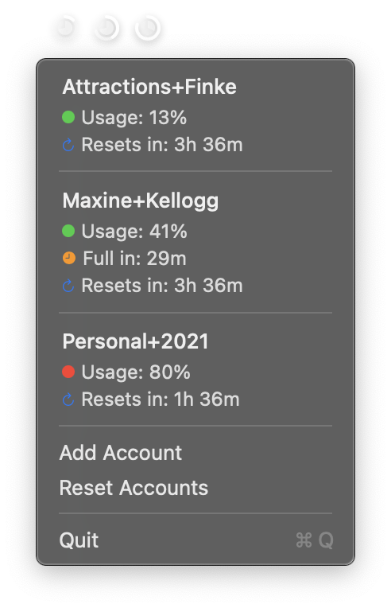

# Claude Usage Menu Bar App

A lightweight macOS menu bar app to monitor Claude AI usage across multiple accounts.



## Installation

Download the latest version from [Releases](https://github.com/atfinke/ClaudeUsage/releases) and move `ClaudeUsage.app` to Applications.

**First time opening:** macOS will block the app because it's not code signed. To fix:

```bash
xattr -cr /path/to/ClaudeUsage.app
```

## Adding Accounts

1. Click menu bar → "Add Account"
2. Click "Open Claude Settings" to open https://claude.ai/settings/usage
3. Open Web Inspector (Cmd+Option+I), go to Network tab, reload page
4. Right-click the `usage` request → "Copy as cURL"
5. Click "Parse from Clipboard" to auto-fill Organization ID and Session Key
6. Add optional account name
7. Click "Add" to validate and save

## Manual Entry

If cURL parsing fails, manually enter:
- Organization ID (from `lastActiveOrg` cookie)
- Session Key (from `sessionKey` cookie, starts with `sk-ant-`)

Find in Safari Developer Tools: Storage tab → Cookies → `https://claude.ai`
